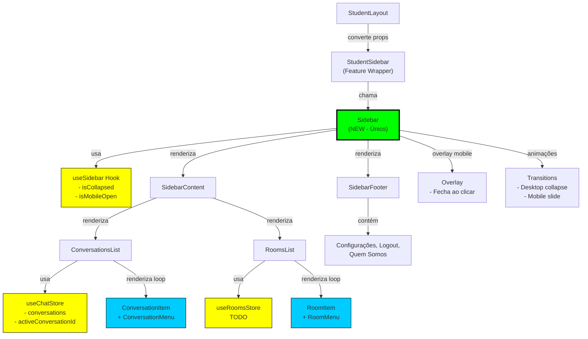

**📐 Diagrama da Arquitetura Nova da Sidebar**



**Benefícios Visuais:**

🟢 **Sidebar Component** - Único container, gerencia tudo
🟡 **Hooks** - Única fonte de verdade por domínio
🔵 **Items** - Componentes simples e focados
⚫ **Props** - Eliminadas (uso de hooks direto)

**Fluxo de Dados (antes vs depois):**

❌ **Antes - Prop Drilling:**
```
StudentLayout
  → props (15+)
    → StudentSidebar
      → props (10+)
        → SidebarConversations
          → onSelectConversation (callback)
          → onDeleteConversation (callback)
```

✅ **Depois - Direto via Hooks:**
```
StudentLayout
  → StudentSidebar (minimal props)
    → Sidebar + ConversationsList
      useChatStore() → useChatStore() [local]
      useSidebar() → useSidebar() [local]
```
```

Salve como: `SIDEBAR_ARCHITECTURE_DIAGRAM.md`
